# Examination - Filmrecensionsplattform

Länk för presentation:  
[https://youtu.be/HcUi32Tnveo](https://youtu.be/HcUi32Tnveo)

---

## API-anrop och exempel

### Register  
Registrera en ny användare i systemet.

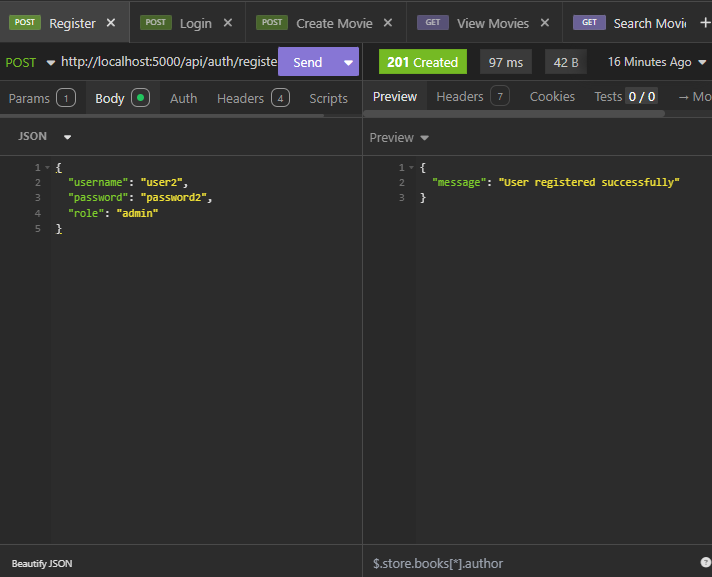

---

### Login  
Logga in med befintliga användaruppgifter för att få access-token.

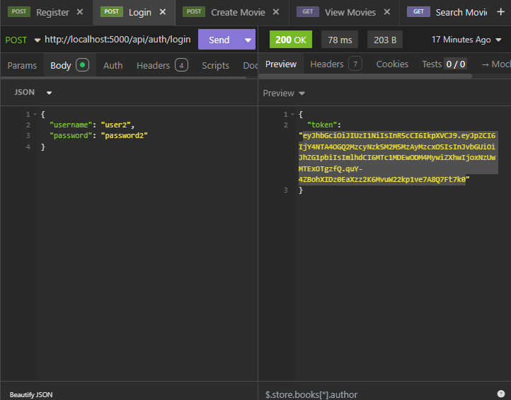

---

### Create Movie  
Skapa en ny film i databasen.

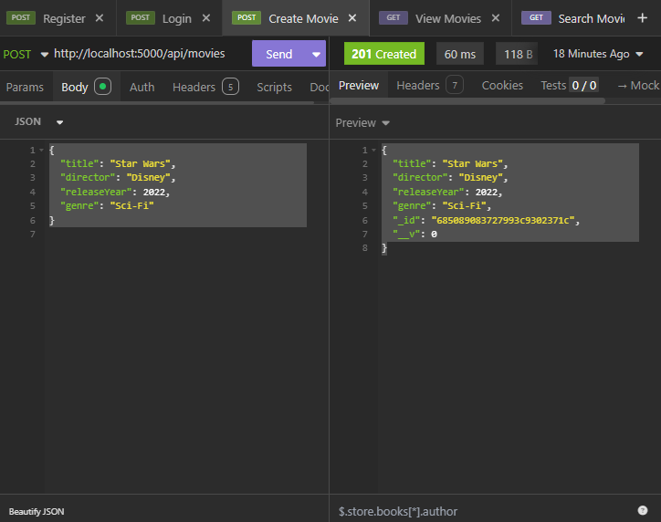

---

### View Movies  
Hämta alla filmer.

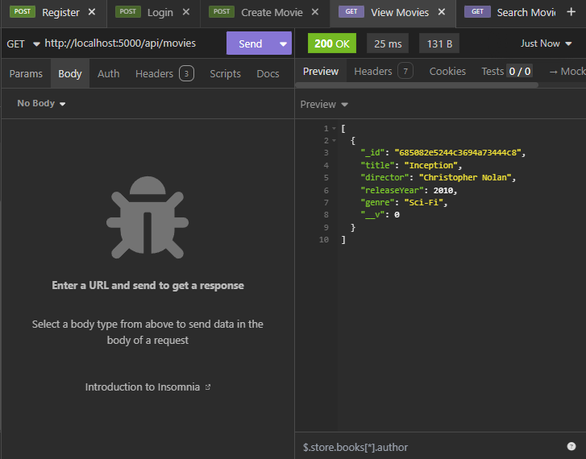

---

### Search Movie  
Sök efter filmer baserat på id.

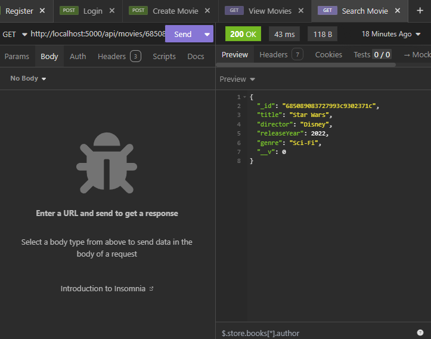

---

### Post Review  
Skapa en recension för en film.

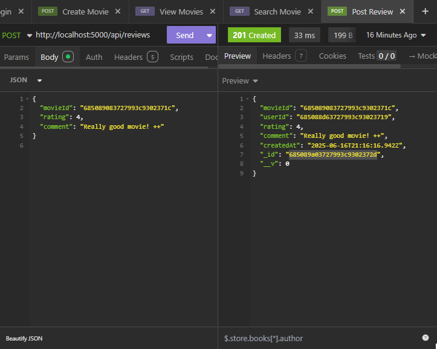

---

### Get all reviews  
Hämta alla recensioner i systemet.

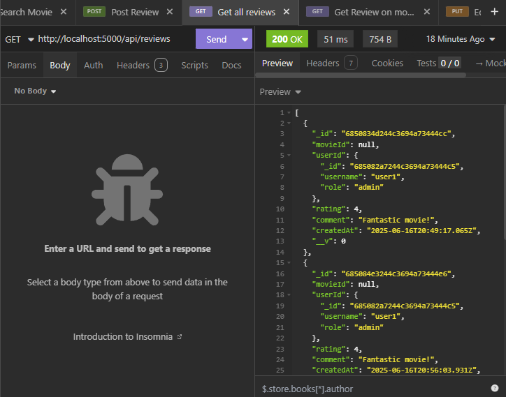

---

### Get Review By ID  
Hämta en specifik recension med dess ID.

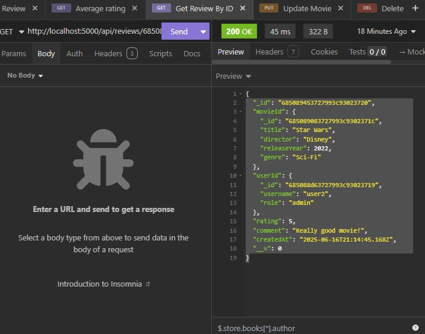

---

### Get Review On Movie ID  
Hämta alla recensioner för en specifik film.

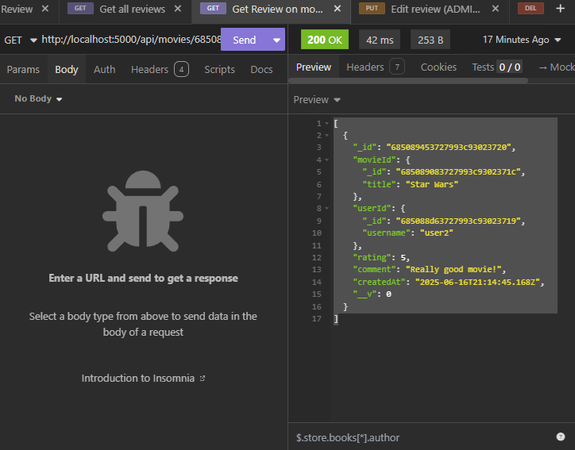

---

### Edit Review  
Redigera en befintlig recension.

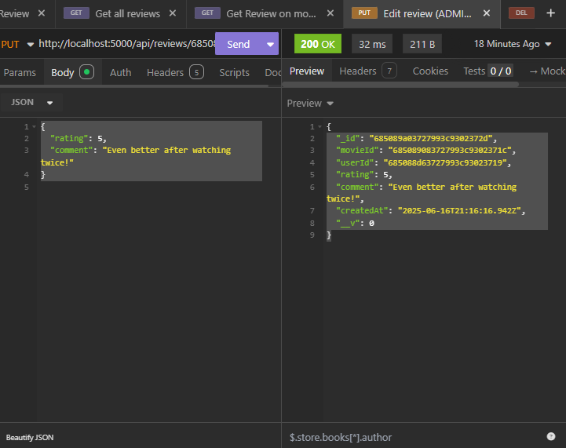

---

### Delete Review  
Ta bort en recension.

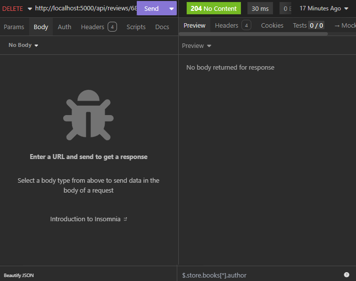

---

### Average Rating  
Hämta genomsnittsbetyg för en film.

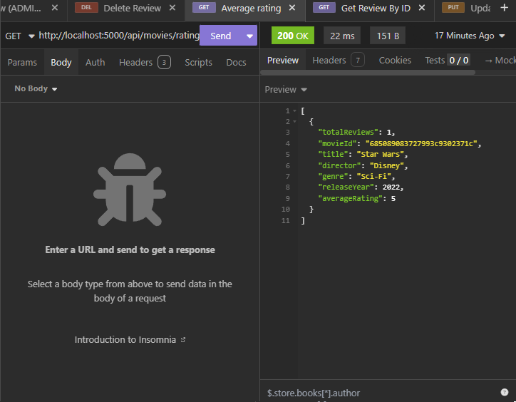

---

### Update Movie  
Uppdatera en films information.

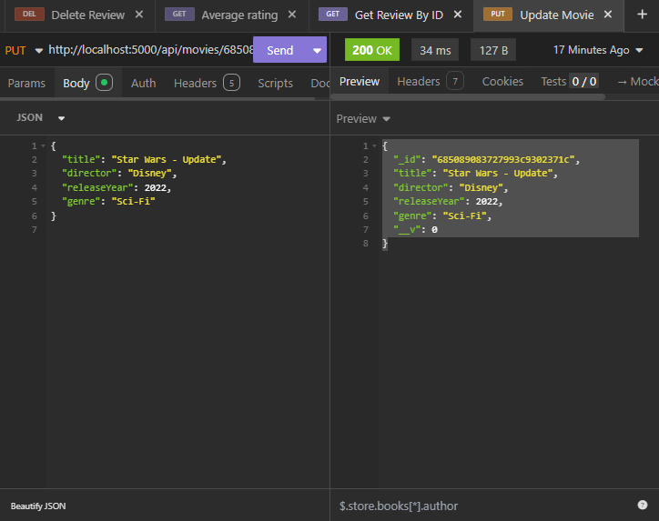

---

### Delete Movie  
Ta bort en film från databasen.

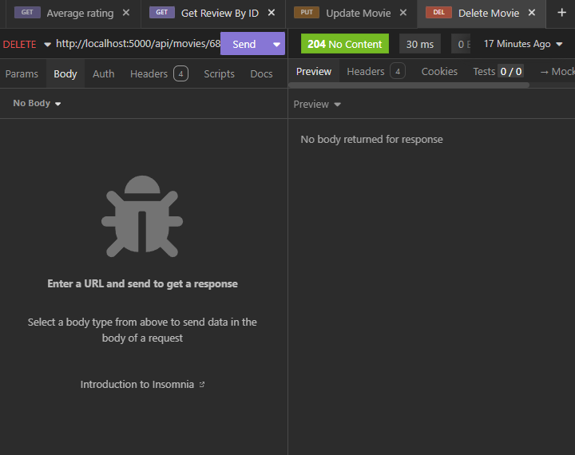

---

## Installation och körning

1. Klona repot  
```bash
git clone https://github.com/SebBersan/filmrecensionsplattform.git

